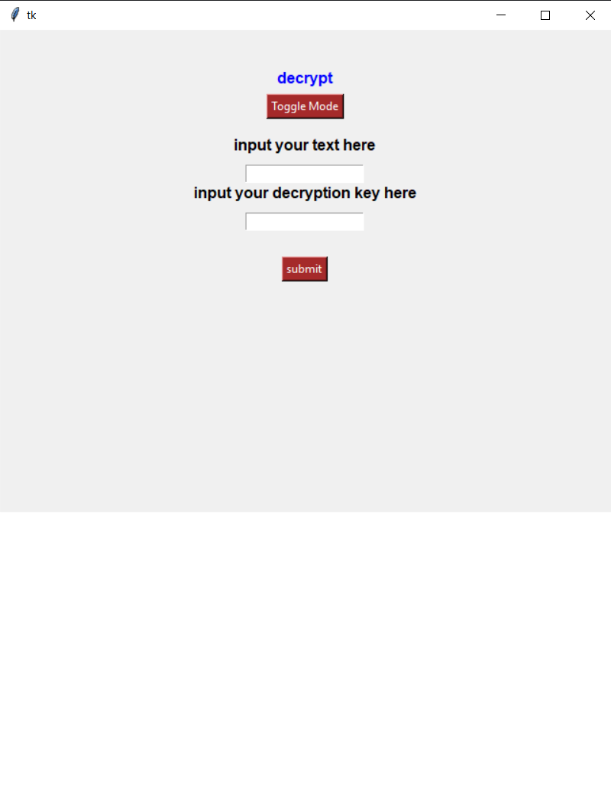

# Whisperer


This is a Simple Windows GUI built using Tkinter for performing AES Symmetric Encryption on Plaintext messages

## Usage
Just download the binary from the releases and run it

With Encryption/Decryption key you must use:
16/32 byte keys i.e. 16/32 characters

## Screenshot



## Built using:
- pytinker
- cryptidy
- pyinstaller

## Building from source
```
git clone git@github.com:fafnirZ/whisperer.git
pip install -r requirements.txt
python3 build.py
```